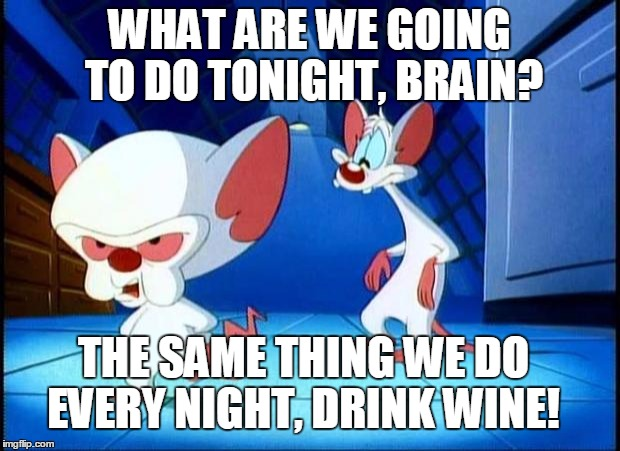

# Content: 

* Introduction and explantion of the dataset and variables 
* Statistic summary
* Univariate analysis of all variables
* Bivariate analysis
* Multivariate analysis
* Final plots 
* Conclusion


# Introduction 

This analysis is about the quality of red wine, the varieties and involving 
their chemical properties as well as the ranking by tasters. The pricing of wine
depends on a rather abstract concept of wine appreciation by wine testers, 
opinion among whom may have a high degree of variablitly. Another key factor is
in wine certification and quality assessment are physiochemical tests, 
laboratory based. It takes into account for example the ph-score and chlorides
amongst others. One interesting question in this context is, if there is a 
correlation between chemical properties and the human taste. 

(source: Penn State Eberly College of Science)

```{r echo=FALSE,warning=FALSE,message=FALSE, Load_Data}

#supressing warnings
knitr::opts_chunk$set(fig.width =9, fig.height=5, fig.path ='Figs/',
                      fig.align= 'center', tidy=TRUE,
                      echo=FALSE,warning=FALSE,message=FALSE)
# Load the Data
rw<- read.csv("~/Desktop/R/wineQualityReds.csv", header=TRUE, sep=",")
rw$X <- NULL

# setting the work directory
setwd("/Users/michaelalueck/desktop/r")

```
##### What are we going to do tonight, Brain? 
##### Same thing we do every night, Pinky. 
oh, veyh Pinky and Brain are analysing the red wine data and plot
how to rule the world with red wine??? 


Objective of the analysis will be to predict the Quality Ranking from the 
chemical properties of the red wine using explanatory data analysis (EDA) to 
explore the relationships between the variables: visualisation, distributions,
outliers and potential anomalies. This project is prepared with R Studio. 

The dataset contains 13 variables and 1599 observations. 

Description of the variables (based on pysiochemical testing)

fixed acidity: most acids involved with wine 
volatile acidity: the amount of acetic acid, very high levels can lead to 
unpleasant taste (vinegar like )
citric acid: can add 'freshness' to the wine
residual sugar: amount of sugar after fermentation stops
chlorides: amount of salt 
free sulfur dioxide: free form of SO2, prevents microbiological growth and 
oxidation total sulfur dioxide: amount of free and bound SO2, becomes evident 
in nose and taste
density: water depending on the percent of alcohol
ph: describes how acid or basic the wine is
sulphates: additive, antimicrobial and antioxidant
alcohol: percent of alcohol
quality: output variable, sensoric data 

```{r echo=FALSE, head}

#display the header 
head(rw)

```


library(ggplot2)

```{r echo=FALSE, Summary}

#summary statistics 
rw_quality_min <-min(rw$quality)
rw_quality_max <-max(rw$quality)
rw_quality_mean <- mean(rw$quality)
rw_quality_median <- median((rw$quality))
rw_quality_iqr <- IQR(rw$quality)
rw_quality_q1 <- rw_quality_median - rw_quality_iqr
rw_quality_q3 <- rw_quality_median + rw_quality_iqr

```

This first summary gives us a first insight. The range of possible socres is
0 to ten. The min in our data set is 3, the max is 8, the median is 6 and the 
mean is 5.64.

```{r echo=FALSE, summary_of_quality}
#quality summary statistic 
summary(rw$quality)

```

The summary function is giving us as well some good information on the 
diffrent variable data. 

```{r echo=FALSE, complete_summary}

#summary of the dataset as table 
summary(rw)

```

```{r echo=FALSE, histogram_of_quality}

#install.packages("ggplot2")
library(ggplot2)

```
The first variable I want to check on is the quality as for me it is the 
first criterion. 

```{r echo=FALSE, q}

#histogramm of quality 
ggplot(data=rw, aes(x=quality))+
  labs(title = "Distribution of Quality")+
  geom_histogram (binwidth = 1, color = 'white', fill= 'red')
 
```

The histogramm shows normal distributed data for the variable quality. As we 
have seen before the median is 6 and the mean is 5.64 which is really near to
the median and the graph perfectly reflects this analysis. 

I think the Quality can be used to make a rating variable. 

```{r echo=FALSE, rating_variable}
rw$rating <- ifelse(rw$quality < 5, 'bad', ifelse(
  rw$quality < 7, 'average', 'good'))
rw$rating <- ordered(rw$rating,
                     levels = c('bad', 'average', 'good'))
```

I am using qplot here as the variable for rating is discrete. 

```{r echo=FALSE, rating_variable1}
#rating of the wine
qplot(x=rating,data = rw)

```

Most of the wines have an average quality, but I decide to make a pie chart
which might look prettier than this simple qplot histogramm. 

```{r echo=FALSE, rating_variable2}

# pie chart for wine rating distribution 
 pie(table(rw$rating),col=c("yellow","blue","red"),
     main="Wine-rating split up")

```

The pie chart is showing that the most of the wines are rated avarage, 
not so many are bad and there are more good wines than bad ones. 

In the next steps I am going to investigate more deeply on the different 
variables and will check if there are outliers. 

# Univariate Plotting 


Pinky is beginning the analysis on the different variables.
What will be the outcome?

```{r echo=FALSE, grid_plot_of_variables}

#loading the needed libraries
library(gridBase)
library(gridExtra)
library(ggplot2)

#variable distribution grid 

d1<-ggplot(data=rw, aes(x=alcohol))+
      geom_histogram (binwidth = 1, color = 'white', fill= 'red')
d2 <- ggplot(data=rw, aes(x=fixed.acidity))+
  geom_histogram (binwidth = 1, color = 'white', fill= 'red')
d3 <- ggplot(data=rw, aes(x=volatile.acidity))+
  geom_histogram (binwidth = 0.1, color = 'white', fill= 'red')
d4 <- ggplot(data=rw, aes(x=citric.acid))+
  geom_histogram (binwidth = 0.1, color = 'white', fill= 'red')
d5 <- ggplot(data=rw, aes(x=residual.sugar))+
  geom_histogram (binwidth = 0.75, color = 'white', fill= 'red')
d6 <- ggplot(data=rw, aes(x=chlorides))+
  geom_histogram (binwidth = 0.03, color = 'white', fill= 'red')
d7 <- ggplot(data=rw, aes(x=free.sulfur.dioxide))+
  geom_histogram (binwidth = 5, color = 'white', fill= 'red')
d8 <- ggplot(data=rw, aes(x=density))+
  geom_histogram (binwidth = 0.001, color = 'white', fill= 'red')
d9 <- ggplot(data=rw, aes(x=pH))+
  geom_histogram (binwidth = 0.15, color = 'white', fill= 'red')
d10 <- ggplot(data=rw, aes(x=sulphates))+
  geom_histogram (binwidth = 0.1, color = 'white', fill= 'red')

grid.arrange(d1,d2,d3,d4,d5,d6, d7,d8,d9,d10, ncol=3)

```

With the graphs I want to check on the distribution of the variables. I decide 
to keep the grid as it is a good first insight. Next step is to check on the 
other variables, their distribution and potentially there could be outliers 
discovered. 

```{r echo=FALSE, alcohol }

#histogramm of fixed acidity  
par(mfrow=c(1,2))
hist(rw$alcohol,xlab="alcohol",ylab="Frequency",main="alcohol Index", col=c("red","blue","green","yellow"))
boxplot(rw$alcohol,main="alcohol Index", xlab="alcohol",ylab="Frequency")

```

The alcohol histogramm is positively skewed and there is a tiny amount of
outliers. The peak is around 9 % alcohol content. Mean and median are close:
10.20 - 10.42

```{r echo=FALSE, fixedacidity }

#histogramm of fixed acidity  
par(mfrow=c(1,2))
hist(rw$fixed.acidity,xlab="fixed.acidity",ylab="Frequency",
     main="fixed.acidity Index", col=c("red","blue","green","yellow"))
boxplot(rw$fixed.acidity,main="fixed.acidity Index",
        xlab="fixed.acidity",ylab="Frequency")

```

Fixed acidy appeared positively skewed and we know a big chunk of the data fall 
between 7 and 9. there seem to be an amount of high outliers.

```{r echo=FALSE, votileacid}
#graphs for votile acidity 
par(mfrow=c(1,2))
hist(rw$volatile.acidity,xlab="volatile.acidity",ylab="Frequency",main="volatile.acidity Index", col=c("red","blue","green","yellow"))
boxplot(rw$volatile.acidity,main="volatile.acidity Index", xlab="volatile.acidity",ylab="Frequency")

```

The distribution of Volatile acidity looks like Bimodal with some outliers. 

```{r echo=FALSE, citircacid}
#graphs for citric acid  
par(mfrow=c(1,2))
hist(rw$citric.acid,xlab="citric.acid",ylab="Frequency",
     main="citric.acid Index", col=c("red","blue","green","yellow"))
boxplot(rw$citric.acid,main="citric.acid Index", 
        xlab="citric.acid",ylab="Frequency")

```

Apart from one outliers, the distribution of Citric acid looks strange. 
It is not easy to describe this distribution, as there are several peaks
in the distribution. 

```{r echo=FALSE, residualsugar}
#graphs for residual sugar  
par(mfrow=c(1,2))
hist(rw$residual.sugar,xlab="residual.sugar",ylab="Frequency",
     main="residual.sugar Index", col=c("red","blue","green","yellow"))
boxplot(rw$residual.sugar,main="residual.sugar Index",
        xlab="residual.sugar",ylab="Frequency")
```

Residual Sugar has two high pillars in the histogramm and the boxplot
is indicating that they are quite an amount of outliers. 
I will add here for more information a log scale: 

```{r echo=FALSE, chlorides}
# chloride graphs 
par(mfrow=c(1,2))
hist(rw$chlorides,xlab="chlorides",ylab="Frequency",main="chlorides Index", col=c("red","blue","green","yellow"))
boxplot(rw$chlorides,main="chlorides Index", xlab="chlorides",ylab="Frequency")

```

There seems to be a high amount of outliers explaining the large bar in the 
histogram. Looks like a long tailed distribution to me.

```{r echo=FALSE, freesulfurdioxide}
# free sulfur graphs 
par(mfrow=c(1,2))
hist(rw$free.sulfur.dioxide,xlab="free sulfur dioxide",
     ylab="Frequency",main="free sulfur dioxide  Index", 
     col=c("red","blue","green","yellow"))
boxplot(rw$free.sulfur.dioxide,main="free sulfur dioxide Index",
        xlab="free sulfur dioxide ",ylab="Frequency")

```

The distribution of free sulfur dioxide is right skewed, the amount of 
outliers is not high. 

```{r echo=FALSE, totalsulfurdioxide}
# total sulfur 
par(mfrow=c(1,2))
hist(rw$total.sulfur.dioxide,xlab="total sulfur dioxide",
     ylab="Frequency",main="total sulfur dioxide  Index", 
     col=c("red","blue","green","yellow"))
boxplot(rw$total.sulfur.dioxide,main="total sulfur dioxide Index",
        xlab="total sulfur dioxide ",ylab="Frequency")

```

The distribution is positively skewed and there are a few outliers, but not 
that high ones.

```{r echo=FALSE, density}
# density graphs 
par(mfrow=c(1,2))
hist(rw$density,xlab="density",
     ylab="Frequency",main="density Index", 
     col=c("red","blue","green","yellow"))
boxplot(rw$density,main="density Index",
        xlab="density ",ylab="Frequency")

```

This looks like an almost normal distribution, the outliers are found
of both sides as well as the the whiskers of the box plot. 

```{r echo=FALSE, phlevel}
# ph level graphs
par(mfrow=c(1,2))
hist(rw$pH, xlab="pH level",
     ylab="Frequency",main="pH level Index", 
     col=c("red","blue","green","yellow"))
boxplot(rw$pH,main="pH level Index",
        xlab="pH level ",ylab="Frequency")
```

The pH level graph two tailed to me with some outliers on both sides. 

```{r echo=FALSE, sulphates}
# ph sulphates
par(mfrow=c(1,2))
hist(rw$sulphates, xlab="sulphates",
     ylab="Frequency",main="sulphates Index", 
     col=c("red","blue","green","yellow"))
boxplot(rw$sulphates,main="sulphates Index",
        xlab="sulphates ",ylab="Frequency")
```

The suphates are long tailes positive skewed and some outlier occur.

I am going to ignore the outliers in my investigation as I am not sure if 
their deletion is not influencing the analysis in a way which would be correct. 


```{r echo=FALSE, alcohol.histogramm}
# Alcohol histogram
ggplot(aes(x = alcohol), data = rw) +
  geom_histogram(binwidth = 0.05) +
  scale_x_continuous(breaks = seq(8, 16, 1)) +
  facet_wrap(~ quality) +
  labs(title = "Comparison of alcohol level distirbution to the  median")+
  labs(x= "level of alcohol in %")+
  geom_vline(aes(xintercept = median(alcohol)), color = "red", linetype = 2)

```

For alcohol, it appears highest rates wines (7-8) have the percentage 
above the median.
 
#### What is the structure of your dataset?

The dataset contains 13 variables and 1599 observations. 

##### What is/are the main feature(s) of interest in your dataset?

I think the most obvious features are quality, alcohol rate and sugar level. 
The more advanced wine consumer might be also interested in ph socre and the
other chemical features. 

##### What other features in the dataset do you think will help support your \
investigation into your feature(s) of interest?

The more advanced wine consumer might be also interested in ph socre and 
he other chemical features. 

##### Did you create any new variables from existing variables in the dataset?

yes, I created a rating variable 

##### Of the features you investigated, were there any unusual distributions? \
Did you perform any operations on the data to tidy, adjust, or change the form \
of the data? If so, why did you do this?

The alcohol rate and free sulfur dioxide are left skewed. Density and pH score
are normally distributed. The alcohol content seems to vary from 8 to 14 with 
major peaks around 10 with a lower count between 13 and 14.
The pH value seems to dispaly a normal distribution with major samples 
exhibiting values between 3.0 and 3.5
We find a normal distribution on the quality and the worst wine and the 
great one might be outliers. Most of the wines can be 
considered as average ones. 


# Bivariate Plots Section

As my/ Brain's main interest is in the quality, it will be interesting to 
check the correlation of the variables espcially
with quality. But it might be also be interesting to check the chemical
variables against each other. 


Pinky is watching Brain working hard ;-) 

```{r echo=FALSE, Plot_dataset}
#overview plot 
plot(rw)
```

Pearson's correlation coefficient is the test statistics that measures the 
statistical relationship, or association, between two continuous variables. 
It is known as the best method of measuring the association between variables 
of interest because it is based on the method of covariance. 
(source https://www.statisticssolutions.com/pearsons-correlation-coefficient/)

A graphic solution: 

```{r echo=FALSE, correlation_diagram}

# First Correlogram Example
library(corrgram)
corrgram(rw, order=TRUE, lower.panel=panel.shade,
  upper.panel=panel.pie, text.panel=panel.txt,
    main="Correlation Diagram Red Wine ")

```

testing example for correlation with the pearson method 

```{r echo=FALSE, test}

#pearson test method 
cor.test(rw$quality, rw$alcohol, method = 'pearson') 
cor.test(rw$quality, rw$residual.sugar, method = 'pearson') 
 
```


```{r echo=FALSE, variables_choosen}

# in order to calculate the correlation matrix I apply a little data 
#transformation 

library(dplyr)
library (pander)

c <- cor(
  rw %>%
    # first we remove unwanted columns
    dplyr::select(-rating) %>%
    mutate(
      # now we translate quality to a number
      quality = as.numeric(quality)
    )
  )
emphasize.strong.cells(which(abs(c) > .3 & c != 1, arr.ind = TRUE))
pandoc.table(c)

```


after all this numbers, time for a little bit of fun :-) 

# Bivariate Analysis

### Talk about some of the relationships you observed in this part of the \
investigation. How did the feature(s) of interest vary with other features in \
the dataset?

Alcohol has negative correlation with density. This is expected as alcohol is
less dense than water.

Residual.sugar does not show correlation with quality.
Free.sulfur.dioxide and total.sulfur.dioxide are highly correlated as expected.

Density has a very strong correlation with fixed.acidity.

### Did you observe any interesting relationships between the other features \
(not the main feature(s) of interest)?

Volatile.acidity has a positive correlation with pH. This is unexpected as pH
is a direct measure of acidity.

### What was the strongest relationship you found?

The variables that have the strongest correlations to quality are
volatile.acidity and alcohol.


# Multivariate Plots Section /  Multivariate Analysis

### Talk about some of the relationships you observed in this part of the \
investigation. Were there features that strengthened each other in terms of \
looking at your feature(s) of interest?

I think it makes sense to check first on the strongest correlation, which is 
the one between alcohol and volatile.acidity. 

```{r echo=FALSE}

# checking on rating, votile acidity and the alcohol level
ggplot(rw, aes(x = rating, y = volatile.acidity, color = alcohol )) +
  labs(title = "Rating, votile acidity and alcohol-level(%) ")+
  geom_jitter() +
  scale_color_gradient(high = 'red', low = 'blue')
  

```

Hm, it looks as if alcohol rate is higher in good wines. But not yet any real
pattern visible despite that. 

## Talk about some of the relationships you observed in this part of the  \
investigation. Were there features that strengthened each other in terms of \
looking at your feature(s) of interest?

My feature of interst is the quality / ranking and what is influencing it. 
Therefore I am going to check not only the alcohol level but as well the 
variables for ph level and acid as well as residual sugar. I suspect there
might be some relationship. 

Next step to try is using the ph-level as this is realted with acidity. 

```{r echo=FALSE}

#scatterplot on citirc acid, alcohol and ph level 
ggplot(rw, aes(x = alcohol, y = citric.acid, color = pH)) +
  labs(x = "alcohol %")+
  labs(title = "citric acid, alcohol (%) and ph- level")+
  geom_jitter() +
  scale_color_gradient(high = 'red', low = 'blue')+
  scale_x_log10()

```

I googled the relation between the ph- level and citirc acid: H3Citrate	citiric 
acid, C6H8O7 (citirc acid)	3.24, 
I found that citric acid is used to regulate the ph- score (in cosmetic 
products) and is an anti- oxidant. (source: wikipedia) 
From my opinion this graph is underlining the correlation between the
ph score and the citric acid addition to a wine. 


```{r echo=FALSE}

#scatterplot on alcohol, density and residual sugar 
ggplot(rw, aes(x = alcohol, y = density, color = residual.sugar)) +
  labs(x = "alcohol %")+
  labs(title = "alcohol (%),density and residual sugar")+
  geom_jitter() +
  scale_color_gradient2(limits=c(0, quantile(rw$residual.sugar, 0.95)),
                        midpoint = median(rw$residual.sugar))+
  scale_x_log10()

```

The higher the density is, the darker is the residual sugar. 

````{r echo=FALSE, map }

#creating heatmap for alcohol level, quality  and density

# create alcohol levels - quartiles:
rw$alcohol.levels = cut(rw$alcohol, quantile(rw$alcohol,
                                             prob = seq(0, 1, length = 5)))

# heatmap - quality and alcohol levels, colored by density
ggplot(subset(rw, !is.na(alcohol.levels)), aes(quality, alcohol.levels)) +
labs(title = "Heatmap - alcohol levels, density and qualtiy") +
 geom_raster(aes(fill = density)) + 
  scale_fill_gradient2(midpoint = median(rw$density))

```

The picture shows a higher density is linked to a lower level of alcohol
and a higher level of quality. 

```{r echo=FALSE, box_plot_statistics}

#rating vrs alcohol boxplot 
ggplot(data=rw, mapping=aes(x= rating, y= alcohol))+
  labs(title = "Boxplot - rating statistics for alcohol level (%)")+
  labs(y = "alcohol %")+
  geom_boxplot()

```

```{r echo=FALSE, scatter_alc_vol}

# scatterplot on votile acidity and alcohol 
ggplot(rw, aes(x = alcohol, y = volatile.acidity, color = factor(quality))) +
  geom_jitter() +
  scale_color_brewer(name = "Quality") +
  ggtitle("Quality by Volitile Acidity and Alcohol") +
  xlab("Alcohol (%)") +
  ylab("Volitile Acidity (g/L)")+
  scale_x_log10()

```

This chart shows how quality improves as the alcohol content increases and the 
volitile acidity decreases.The overall trend of the colors getting darker as 
they go to the bottom right. The second plot shows the relation of the rating 
with votile acidity and pH score. I was interested in the result because 
normally acidity and pH have a strong correlation. 

```{r echo=FALSE, Plot_TwoPrepa}

# plot fot quality and alcohol content linear model 
ggplot(rw, aes(x = alcohol, y = quality)) +
  geom_jitter(alpha = 0.1, height = 0.48, width = 0.025) +
  ggtitle("Quality vs Alcohol Content") +
  geom_smooth(method = "lm") +
  xlab("Alcohol (%)") +
  ylab("Quality (0-10)")
 

```

The boxplot shown in the analysis above  is devlivering less information than
the scatterplot, but it is more compact and they can be easily compared.
Here we can see that good wines have a higher level 
of alcohol. Both pictures are to be seen complementary to underline the 
correlation between quality / rating and alcohol content

```{r echo=FALSE, Plot_Three_prepa}

# final plot for density alcohol and rating 
ggplot(data=rw, aes(x=alcohol, y=density, color=rating))+
geom_point(alpha=0.5, size=0.5)+
geom_jitter(alpha=0.3)+ 
geom_smooth(method='lm', se=FALSE)+
 xlab('Alcohol Percentage') + 
ylab('redwine Density in gramm per decimeter')+
 ggtitle('Redwine Density and Alcohol % for 
         Different Category of redwine Rating')+
  scale_x_log10()

```

This graph is putting together the density, the alcohol percentage and the 
rating. From my opinion these are good correlated variables and we clearly see
the average wines have have a stronger density than the good ones, we have
a few exceptions due to outliers. 

### Were there any interesting or surprising interactions between features?
The density decreases as the alcohol increases. What may not be as obvious 
is that the density increases as sugar increases, but it's along the opposite
direction. The median of the residual sugar lies parallel to the alcohol vs 
density trendline. 
Interesting as I had no knowledge about wine before doing this analyis.


# Final Plots and Summary
### Plot One

```{r echo=FALSE, Plot_One}

# intro plot with mean and meadian for final analysis
ggplot(rw, aes(alcohol)) +
  geom_histogram(binwidth = 0.1, color = 'white', fill= 'red') +
  geom_vline(xintercept = median(rw$alcohol), color = 'blue') +
  annotate('text',
           x = median(rw$alcohol) - 0.35,
           y = 120,
           label = paste('median\n(', median(rw$alcohol), ')', sep = ''),
           color = 'blue') +
  geom_vline(xintercept = mean(rw$alcohol), color = 'darkgreen') +
  annotate('text',
           x = mean(rw$alcohol) + 0.35,
           y = 120,
           label = paste('mean\n(', round(mean(rw$alcohol), 2), ')', sep = ''),
           color = 'darkgreen') +
  ggtitle("Distribution of Alcohol Percentages") +
  xlab("Alcohol content (%)") +
  ylab("Number of wines")

```


### Description One

We see here the right skewed distribution of the alcohol and the number of
wines, the mean (10,42%) and the median (10.2%)
are realtively close.There are not many wines which have a percentage 
higher than 12%. I have chosen this plot as is is a more detailed view than 
the one in the univariate section. 

### Plot Two

```{r echo=FALSE, Plot_Two}

# plot fot quality and alcohol content linear model 
ggplot(data=rw, mapping=aes(x = alcohol, y = quality, color= alcohol.levels)) +
  geom_jitter(alpha = 0.1, height = 0.48, width = 0.025) +
  geom_smooth(method = "loess") +
  ggtitle("Quality vs Alcohol Content") +
  xlab("Alcohol (%)") +
  ylab("Quality (0-10)")+
  scale_x_log10()

```

### Description Two

Adding the lm smooth method is adding good information to the plot Smoothers fit
a model to my data and are plotting the predicition (loess gives a good
apperance, I used it as we have dataset which is not too big, loesis O(N2)
in memory, so does not work for larger datasets.) . The graph is well 
underlying that good wines have a higher level of alcohol. 
This graph is con be seen complementary to underline the 
correlation between quality alcohol content. Interesting is here that the 
increase of alcohol is not endlessly increasing the quality. 

### Plot Three

```{r echo=FALSE, Plot_Three}

# final plot for density alcohol and rating 
ggplot(data=rw, aes(x=alcohol, y=density, color=rating))+
geom_point(alpha=0.5, size=0.5)+
geom_jitter(alpha=0.3)+ 
geom_smooth(method='lm', se=FALSE)+
 xlab('Alcohol Percentage') + 
ylab('redwine Density in gramm per decimeter')+
 ggtitle('Redwine Density and Alcohol % for 
         Different Category of redwine Rating')+
  scale_x_log10()

```

### Description Three

Density of wine is strong. The higher the alcohol %, the lower is the density.
It’s clearly visible that in this plot, stronger wine tend to have higher 
rating. I decided to take this plot from the multivariate analyis as my final 
plot as it is showing the correlations explained earlier very clearly. 

------

# Reflection

As I do not know much about chemistry, my analysis is clearly limited and 
there is potential to take more care of the correlations
between them. My analysis is concentrated clearly on quality / ranking - 
a variable I built, and the density and level of alcohol.
It shows there is a strong link between them. According to my analyis a 
good wine has a level of alcohol around 10% and 10.5%. From the 
the final plot 1 we can say a good wine has a votile acidity 0.4. 
The additional checking of votile acidity and pH together with 
quality did not give much more insight.

I had a struggle with finding a good method of correlating the variables 
whereas the first steps went pretty ok.
I did not pay much attention on outliers. All in all it was fun to step 
into something really new as I never had any touch with R. 
I learned that R is a very powerful tool in explanatory data analysis 
and give pretty surprising insights of an anknown topic. 

Remark: additional struggle for me was also, know after having submitted, to 
exactly understand the specifications correctly. As I tried to make polished
graphs througout the project, it was not easy to match the final plot section as 
I see no added value in double information in the report. For the third graph
I did copy and paste as I had no idea how to polish even more :-) 

The topic of building a model could be one of further investigation. 
I am not sure how to choose the best variables for a predictive model. 
Nevertheless the  regression I am showing on alcohol level and quality
is an entry point. 

On top my knowledge of wine is so limited that 
I would like to know which acids could explain the variation 
in the pH score as I think the 
three listed ones do not explain well enough. 

In summarization it is interesting to have worked on the content of wine. 
I just want to state that the human taste shall not be underestimated :-)
even though the rating is based on human taste. 



And on top I hope you enjoy the little side story of Pinky and Brain which 
is my favourite comic show. When I am working 
together at work with a programmer we always make the joke that we 
are Pinky and Brain, never sure, who is who. 

